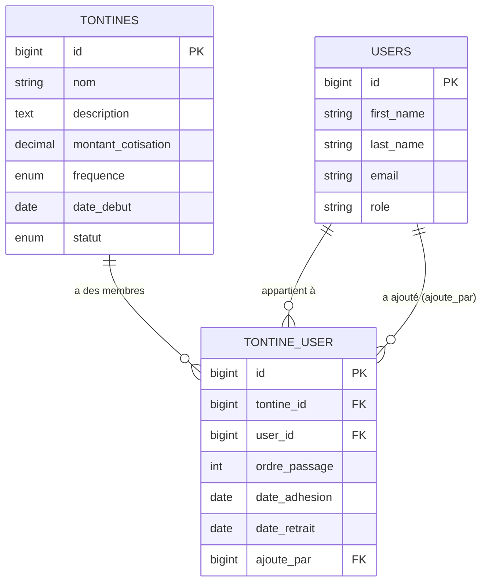

# Design Technique — Gestion des Tontines

## Vue d'ensemble

La feature `gestion-tontines` refactorise la relation tontine ↔ utilisateur d'une association `HasMany` (FK `tontine_id` sur `users`) vers une relation `BelongsToMany` via une table pivot `tontine_user`. Elle expose une API REST JSON sécurisée par Sanctum avec deux niveaux d'accès : admin (CRUD complet + gestion des membres) et membre (lecture de ses propres tontines).

Le cycle de vie d'une tontine est gouverné par quatre statuts (`en_attente`, `active`, `terminee`, `archivee`) qui conditionnent les opérations autorisées.

---

## Architecture

### Vue d'ensemble des couches

```
Client HTTP
    │
    ▼
Routes (routes/api.php)
    │  middleware auth:sanctum
    │  middleware role:admin  ──► Admin/TontineController
    │                         ──► Admin/MembreTontineController
    │  middleware auth:sanctum ──► Membre/MesTontinesController
    │
    ▼
Controllers
    │  FormRequest (validation)
    │
    ▼
Models (Tontine, User, TontineUser)
    │  BelongsToMany via tontine_user
    │
    ▼
PostgreSQL
    ├── tontines
    ├── tontine_user (pivot)
    └── users
```

### Règles métier par statut

| Statut      | Modifier | Ajouter membres | Supprimer |
|-------------|----------|-----------------|-----------|
| en_attente  | ✅       | ✅              | ❌        |
| active      | ✅       | ✅              | ❌        |
| terminee    | ❌       | ❌              | ✅        |
| archivee    | ❌       | ❌              | ❌        |

---

## Composants et Interfaces

### Routes

```php
// Admin — protégées par auth:sanctum + role:admin + prefix /api/admin
GET    /api/admin/tontines
POST   /api/admin/tontines
GET    /api/admin/tontines/{tontine}
PUT    /api/admin/tontines/{tontine}
DELETE /api/admin/tontines/{tontine}
POST   /api/admin/tontines/{tontine}/membres
DELETE /api/admin/tontines/{tontine}/membres/{user}

// Membre — protégées par auth:sanctum
GET    /api/mes-tontines
GET    /api/mes-tontines/{tontine}
```

### Admin/TontineController

| Méthode  | Action                                                                 |
|----------|------------------------------------------------------------------------|
| `index`  | Liste toutes les tontines avec `membres_count` (withCount)             |
| `store`  | Crée une tontine, statut par défaut `en_attente`                       |
| `show`   | Retourne la tontine avec ses membres (pivot : ordre_passage, date_adhesion) |
| `update` | Met à jour si statut `en_attente` ou `active`, sinon 422               |
| `destroy`| Supprime si statut `terminee`, sinon 422 ; cascade sur `tontine_user`  |

**FormRequests :**
- `StoreTontineRequest` : nom required, montant_cotisation > 0, frequence in enum, date_debut date
- `UpdateTontineRequest` : mêmes règles en `sometimes`, statut in enum

### Admin/MembreTontineController

| Méthode   | Action                                                                 |
|-----------|------------------------------------------------------------------------|
| `store`   | Ajoute un membre à une tontine (vérifie statut, unicité, ordre_passage)|
| `destroy` | Retire un membre d'une tontine (supprime la ligne pivot)               |

**FormRequest :**
- `AjouterMembreRequest` : user_id exists:users, ordre_passage integer > 0, date_adhesion date required

### Membre/MesTontinesController

| Méthode | Action                                                                  |
|---------|-------------------------------------------------------------------------|
| `index` | Liste les tontines du membre connecté avec leurs membres                |
| `show`  | Détail d'une tontine — vérifie que le membre en fait partie (403 sinon) |

### Modèle Tontine — méthodes métier

```php
public function peutEtreModifiee(): bool
{
    return in_array($this->statut, ['en_attente', 'active']);
}

public function peutAjouterMembres(): bool
{
    return in_array($this->statut, ['en_attente', 'active']);
}

public function peutEtreSupprimee(): bool
{
    return $this->statut === 'terminee';
}
```

---

## Modèles de Données

### Migration 1 — Modifier `tontines` (statut enum)

Changer l'enum `statut` de `['active', 'inactive', 'terminee']` vers `['en_attente', 'active', 'terminee', 'archivee']` avec défaut `en_attente`.

Stratégie PostgreSQL : supprimer la colonne et la recréer (les enums PostgreSQL ne supportent pas `change()` directement avec doctrine/dbal pour les enums).

### Migration 2 — Créer `tontine_user` (pivot)

```
tontine_user
├── id                  bigint PK auto-increment
├── tontine_id          bigint FK → tontines (cascade delete)
├── user_id             bigint FK → users (cascade delete)
├── ordre_passage       unsignedInteger NOT NULL
├── date_adhesion       date NOT NULL
├── date_retrait        date NULL
├── ajoute_par          bigint FK → users NULL
├── created_at          timestamp
├── updated_at          timestamp
├── UNIQUE (tontine_id, user_id)
└── UNIQUE (tontine_id, ordre_passage)
```

### Migration 3 — Supprimer colonnes de `users`

Supprimer : `tontine_id`, `ordre_passage`, `date_adhesion` de la table `users`.

### Model Tontine

```php
protected $fillable = ['nom', 'description', 'montant_cotisation', 'frequence', 'date_debut', 'statut'];

protected $casts = [
    'date_debut'         => 'date',
    'montant_cotisation' => 'decimal:2',
];

public function membres(): BelongsToMany
{
    return $this->belongsToMany(User::class, 'tontine_user')
        ->withPivot(['ordre_passage', 'date_adhesion', 'date_retrait', 'ajoute_par'])
        ->withTimestamps();
}
```

### Model User

```php
// Remplacer tontine(): BelongsTo par :
public function tontines(): BelongsToMany
{
    return $this->belongsToMany(Tontine::class, 'tontine_user')
        ->withPivot(['ordre_passage', 'date_adhesion', 'date_retrait', 'ajoute_par'])
        ->withTimestamps();
}

// Retirer du $fillable : 'tontine_id', 'ordre_passage', 'date_adhesion'
```

### Model TontineUser (pivot)

```php
class TontineUser extends Pivot
{
    protected $table = 'tontine_user';

    protected $fillable = [
        'tontine_id', 'user_id', 'ordre_passage',
        'date_adhesion', 'date_retrait', 'ajoute_par',
    ];

    protected $casts = [
        'date_adhesion' => 'date',
        'date_retrait'  => 'date',
    ];
}
```

### Diagramme ERD



---

## Propriétés de Correction

*Une propriété est une caractéristique ou un comportement qui doit être vrai pour toutes les exécutions valides d'un système — c'est-à-dire une déclaration formelle de ce que le système doit faire. Les propriétés servent de pont entre les spécifications lisibles par l'humain et les garanties de correction vérifiables par machine.*

### Propriété 1 : Création valide → statut par défaut en_attente

*Pour toute* combinaison de données valides (nom non vide, montant > 0, fréquence dans l'enum, date_debut valide) soumise sans statut explicite, la tontine créée doit avoir le statut `en_attente` et la réponse doit être 201.

**Valide : Exigences 1.1, 1.5, 10.2**

---

### Propriété 2 : Validation des champs invalides → 422

*Pour tout* champ invalide (nom vide ou whitespace, montant_cotisation ≤ 0, fréquence hors enum, statut hors enum), la requête de création ou modification doit être rejetée avec une réponse 422.

**Valide : Exigences 1.2, 1.3, 1.4, 4.3, 4.4, 4.5**

---

### Propriété 3 : Modification bloquée si statut terminee ou archivee → 422

*Pour toute* tontine dont le statut est `terminee` ou `archivee`, toute tentative de modification (PUT/PATCH) doit retourner une réponse 422 avec le message approprié.

**Valide : Exigences 4.2, 10.4**

---

### Propriété 4 : Suppression bloquée si statut ≠ terminee → 422

*Pour toute* tontine dont le statut est `en_attente`, `active` ou `archivee`, toute tentative de suppression doit retourner une réponse 422.

**Valide : Exigences 5.2, 10.7**

---

### Propriété 5 : Cascade suppression → tontine_user vidée

*Pour toute* tontine supprimée (statut `terminee`), toutes les lignes correspondantes dans `tontine_user` doivent être supprimées automatiquement.

**Valide : Exigence 5.4**

---

### Propriété 6 : Ajout membre valide → ligne pivot créée avec métadonnées

*Pour tout* membre valide ajouté à une tontine dont le statut est `en_attente` ou `active`, une ligne doit être créée dans `tontine_user` avec `date_adhesion` renseignée et `ajoute_par` égal à l'id de l'admin authentifié.

**Valide : Exigences 6.1, 6.8, 12.2**

---

### Propriété 7 : Doublon d'inscription → 422

*Pour tout* membre déjà inscrit dans une tontine, une seconde tentative d'inscription dans cette même tontine doit retourner une réponse 422 avec le message "Ce membre est déjà inscrit dans cette tontine".

**Valide : Exigences 6.3, 9.2, 9.3**

---

### Propriété 8 : Unicité de l'ordre de passage → 422 si doublon

*Pour tout* ordre_passage déjà attribué dans une tontine, toute tentative d'assigner ce même ordre à un autre membre dans la même tontine doit retourner une réponse 422.

**Valide : Exigences 6.4, 11.2, 11.4**

---

### Propriété 9 : Ajout membre bloqué si statut terminee ou archivee → 422

*Pour toute* tontine dont le statut est `terminee` ou `archivee`, toute tentative d'ajout de membre doit retourner une réponse 422.

**Valide : Exigences 6.7, 10.6**

---

### Propriété 10 : Retrait membre → isolation des autres appartenances

*Pour tout* membre inscrit dans plusieurs tontines, le retrait de ce membre d'une tontine doit supprimer uniquement la ligne pivot correspondante, sans affecter ses autres inscriptions dans d'autres tontines.

**Valide : Exigences 7.1, 7.2, 9.4**

---

### Propriété 11 : Isolation des tontines d'un membre

*Pour tout* membre authentifié, la liste retournée par `GET /api/mes-tontines` doit contenir exactement et uniquement les tontines auxquelles ce membre est inscrit dans `tontine_user`.

**Valide : Exigences 8.1, 8.6, 13.3**

---

### Propriété 12 : Accès tontine non-membre → 403

*Pour tout* membre authentifié tentant d'accéder au détail d'une tontine dont il ne fait pas partie, la réponse doit être 403.

**Valide : Exigences 8.4, 13.4**

---

### Propriété 13 : Appartenance multiple autorisée

*Pour tout* membre, il doit être possible de l'inscrire dans N tontines différentes simultanément, chaque inscription créant une ligne distincte dans `tontine_user`.

**Valide : Exigence 9.1**

---

### Propriété 14 : membres_count correct dans la liste admin

*Pour toute* liste de tontines retournée par `GET /api/admin/tontines`, le champ `membres_count` de chaque tontine doit correspondre exactement au nombre de lignes dans `tontine_user` pour cette tontine.

**Valide : Exigence 2.1, 2.2**

---

## Gestion des Erreurs

| Situation                                      | Code HTTP | Message                                                                 |
|------------------------------------------------|-----------|-------------------------------------------------------------------------|
| Non authentifié                                | 401       | Unauthenticated                                                         |
| Rôle insuffisant                               | 403       | This action is unauthorized                                             |
| Tontine non trouvée                            | 404       | Not found                                                               |
| Utilisateur non trouvé                         | 404       | Not found                                                               |
| Champ de validation invalide                   | 422       | Détail par champ                                                        |
| Modification tontine terminee/archivee         | 422       | La tontine ne peut être modifiée que si son statut est 'en_attente' ou 'active' |
| Suppression tontine non terminee               | 422       | La tontine ne peut être supprimée que si son statut est 'terminee'      |
| Ajout membre sur tontine terminee/archivee     | 422       | L'ajout de membres n'est pas autorisé pour une tontine avec ce statut   |
| Membre déjà inscrit                            | 422       | Ce membre est déjà inscrit dans cette tontine                           |
| Ordre de passage déjà pris                     | 422       | Cet ordre de passage est déjà attribué dans cette tontine               |
| Membre n'appartient pas à la tontine           | 422       | Ce membre n'appartient pas à cette tontine                              |
| Accès tontine non-membre                       | 403       | Vous n'avez pas accès à cette tontine                                   |

Toutes les erreurs sont retournées en JSON avec la structure :
```json
{
  "message": "...",
  "errors": { "champ": ["message d'erreur"] }
}
```

---

## Stratégie de Tests

### Approche duale

Les tests unitaires et les tests basés sur les propriétés sont complémentaires et tous deux nécessaires.

**Tests unitaires** — cas spécifiques, intégration, cas limites :
- Création tontine avec chaque champ invalide (nom vide, montant nul, fréquence invalide)
- Accès non authentifié sur chaque endpoint → 401
- Accès membre sur endpoints admin → 403
- Tontine inexistante → 404
- Membre n'appartient pas à la tontine → 422 au retrait
- Liste vide quand aucune tontine
- Valeurs d'ordre_passage non consécutives acceptées (1, 5, 10)

**Tests de propriétés (PBT)** — propriétés universelles :
- Bibliothèque : [eris/eris](https://github.com/giorgiosironi/eris) (PHP) ou tests paramétrés PHPUnit avec générateurs custom
- Minimum 100 itérations par test de propriété
- Chaque test référence la propriété du design via un commentaire de tag

### Format de tag

```php
// Feature: gestion-tontines, Property {N}: {texte de la propriété}
```

### Mapping Propriétés → Tests PBT

| Propriété | Test PBT                                                                                      |
|-----------|-----------------------------------------------------------------------------------------------|
| P1        | Générer N tontines valides sans statut → vérifier statut=en_attente et HTTP 201               |
| P2        | Générer des valeurs invalides pour chaque champ → vérifier HTTP 422                           |
| P3        | Générer tontines avec statut terminee/archivee → PUT → vérifier HTTP 422                      |
| P4        | Générer tontines avec statut en_attente/active/archivee → DELETE → vérifier HTTP 422          |
| P5        | Créer tontine + membres → DELETE tontine → vérifier tontine_user vide                         |
| P6        | Générer membres + tontines valides → POST membre → vérifier ligne pivot + métadonnées         |
| P7        | Ajouter membre → retenter → vérifier HTTP 422                                                 |
| P8        | Ajouter membre avec ordre X → ajouter autre membre avec ordre X → vérifier HTTP 422           |
| P9        | Générer tontines terminee/archivee → POST membre → vérifier HTTP 422                          |
| P10       | Inscrire membre dans 2 tontines → retirer d'une → vérifier présence dans l'autre              |
| P11       | Créer N tontines, inscrire membre dans K d'entre elles → GET mes-tontines → vérifier K items  |
| P12       | Créer tontine sans le membre → GET /mes-tontines/{id} → vérifier HTTP 403                     |
| P13       | Inscrire membre dans N tontines → vérifier N lignes dans tontine_user                         |
| P14       | Créer tontine avec K membres → GET admin/tontines → vérifier membres_count = K                |
